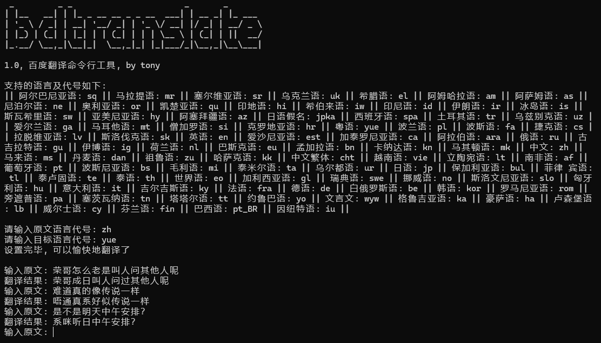

# 这里放工作中开发的一些工具

## 0x01 urlchecker.exe

> 检查execl文件中url列的访问情况，输出结果excel为包含访问异常的行，在原有excel基础上，新增“错误代码”、“错误信息”两列。

## 0x02 wxocr.exe

> 基于windows微信客户端的文本识别服务开发的ocr工具，支持对图片/pdf进行单个/批量识别和标注，输出json识别结果。

## 0x03 rename.exe

> 批量重命名文件工具

## 0x04 translate.exe

> 命令行翻译工具，基于百度翻译服务

## 0x05 header_convert.exe

> 从浏览器里复制来的header格式化为主流语言的map/dict

## 0x06 pdf_converter.exe

> word/excel/ppt转pdf工具

